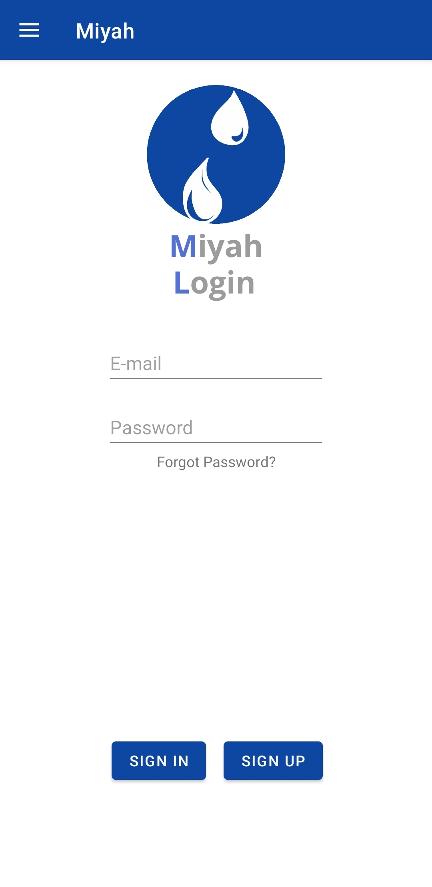
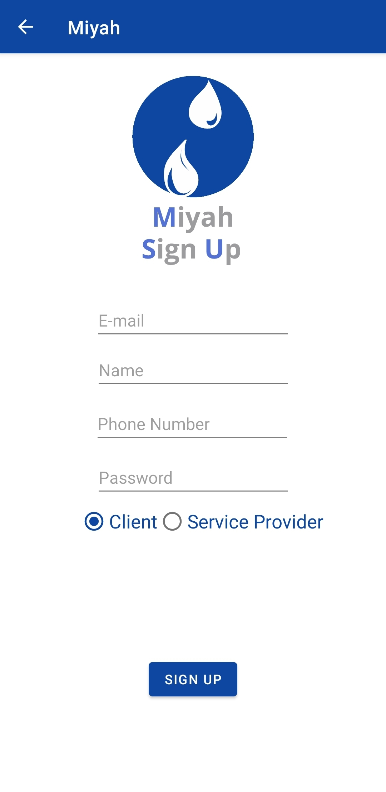
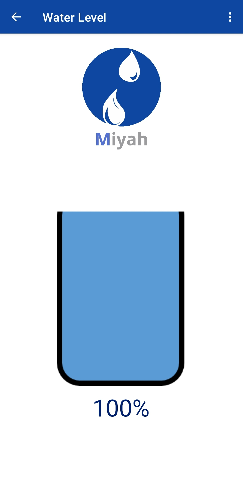
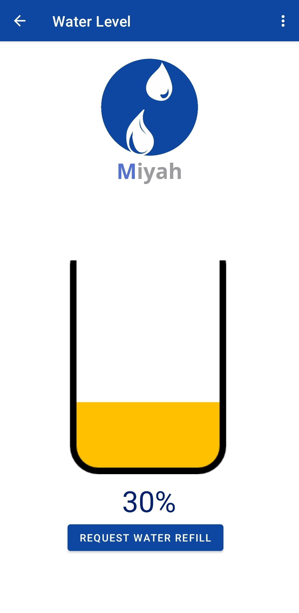
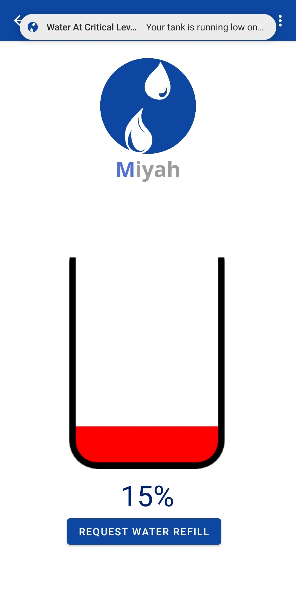
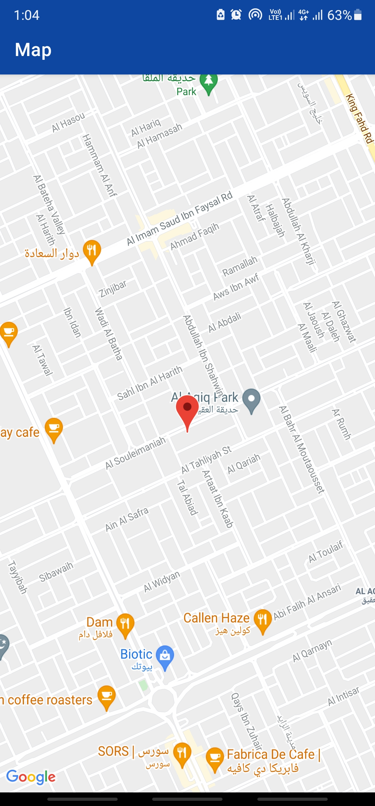
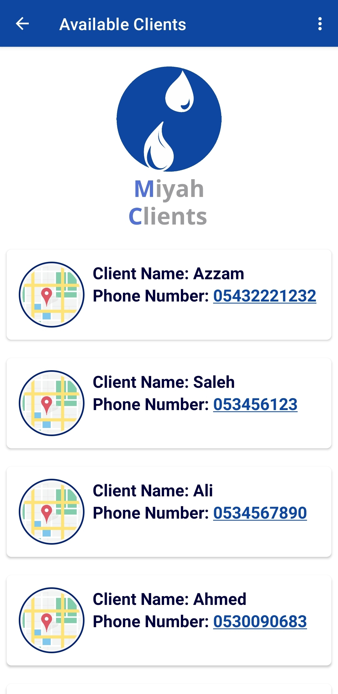

## Miyah

Miyah, the Android application for the Smart Water Level Detecting System IoT graduation project. It authenticates users through the Firebase Authentication API and makes network calls to a realtime Firebase database integrated with an Arduino microcontrollers to calculate water level and notify users accordignly, as well as providing a water-refill service via requesting a service provider whom can view a list of available clients.

## Screenshots

